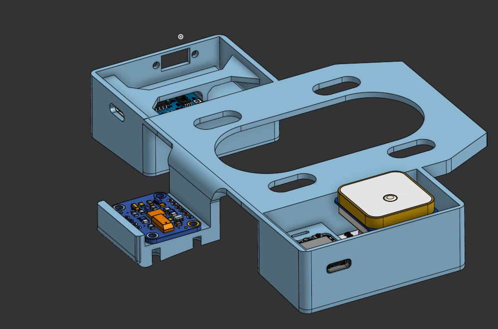
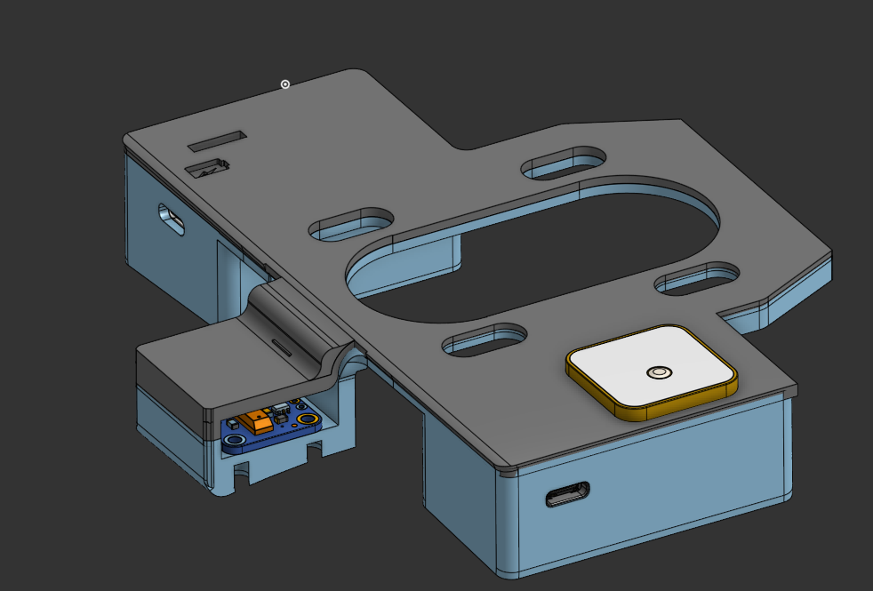
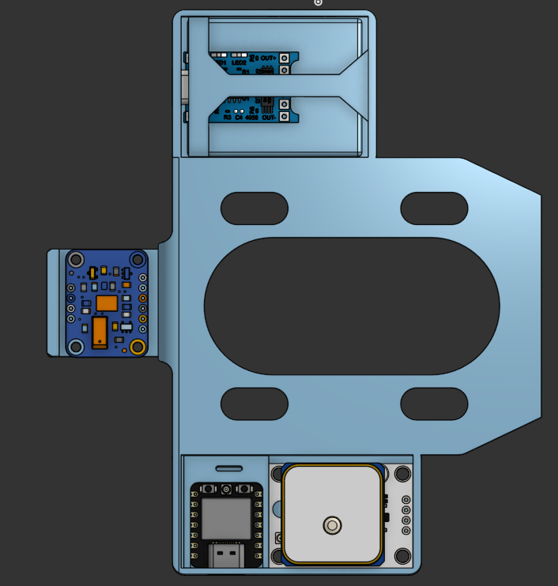
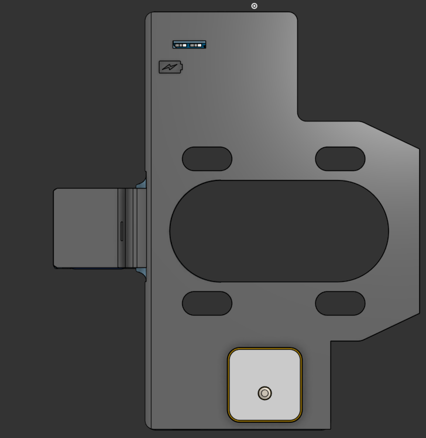
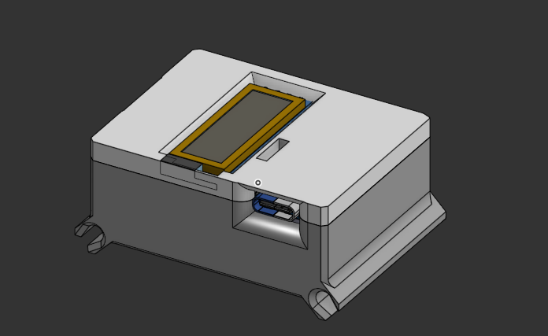
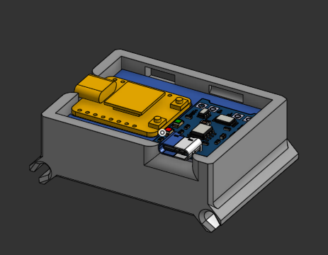
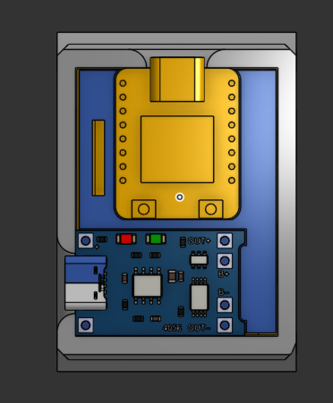
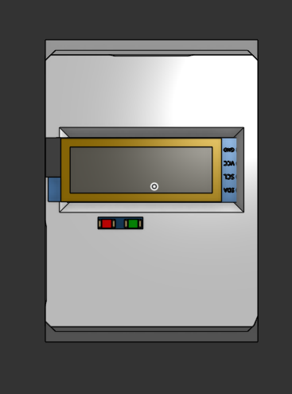
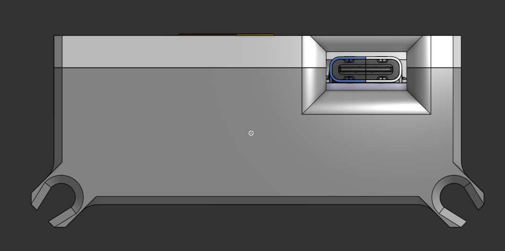

# Phase 1 — Foundation and Design (Week 1)

**Planned:** finalise the prototype layout, lock the wobble threshold, confirm the kickflip approach and procure the hardware.

**Delivered:** the layout and the detection approach were fixed, and the parts list was bought around two XIAO ESP32-C3 boards.

- Board unit mounted under the deck on a plate that bolts around the truck baseplate; wrist unit on a strap.
- Parts: two Seeed XIAO ESP32-C3 boards, a BNO055 IMU, a NEO-8M GPS, an SSD1306 128×32 OLED, two 1500 mAh lithium cells, two USB-C charging modules, a vibration motor and indicator LEDs.
- Kickflip detection scoped to rotation on one gyro axis, with the landing judged by how the deck settles rather than by an impact spike.
- Wobble redefined as a counted oscillation pattern instead of a 25 km/h speed trigger. The reasoning is in the root [README](../../README.md) and the project report.

## CAD design

Both enclosures were designed in CAD before anything was printed, so component clearances, port positions and the mounting pattern were settled on screen rather than in filament. Both are 3D-printed, two-part enclosures holding their board, a 1500 mAh lithium cell and a USB-C charging module, with every port and indicator reachable without opening the case.

### Board unit

The board enclosure is a mounting plate that sits between the deck and the truck, with the hardware split into three compartments so each part gets what it needs: the GPS patch antenna faces up with a clear view of the sky, the IMU sits in its own pod on the plate's edge where it reads the deck's rotation directly, and the XIAO, cell and charging module fill the opposite compartment. The oval and slotted cut-outs drop weight and clear the mounting bolts.

### Wrist unit

The wrist enclosure is a lidded box with lugs at all four corners for the strap. The OLED sits in a window in the lid with its four pins (GND, VCC, SCL, SDA) running to the XIAO below, and the two indicator LEDs show through beneath it. The USB-C port of the charging module is recessed into the side wall, so the unit charges on the wrist without being opened.

## Open question

Print material, layer height, infill and the finished dimensions of each enclosure are not recorded yet.
