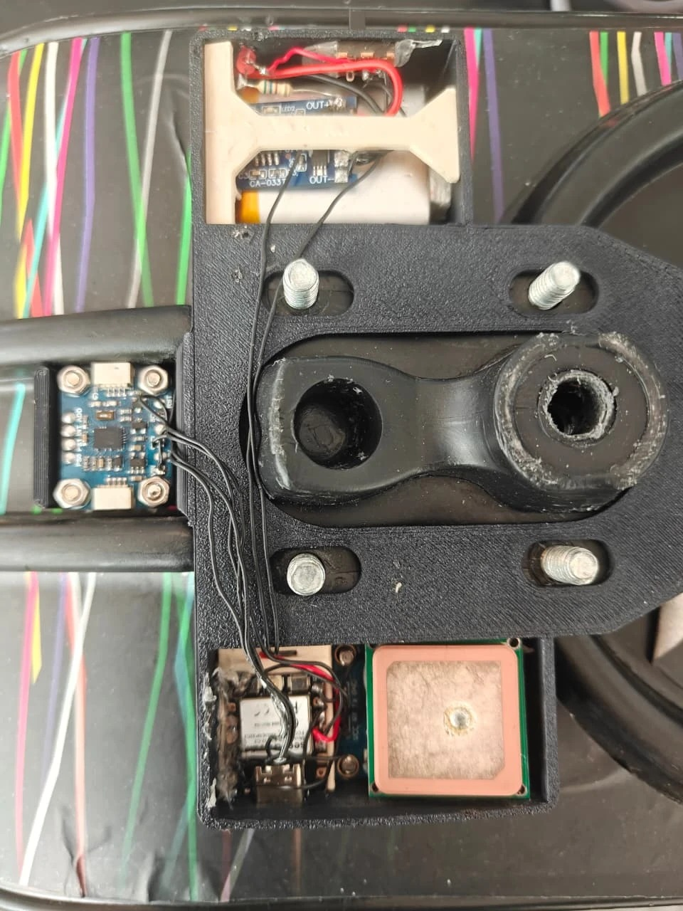
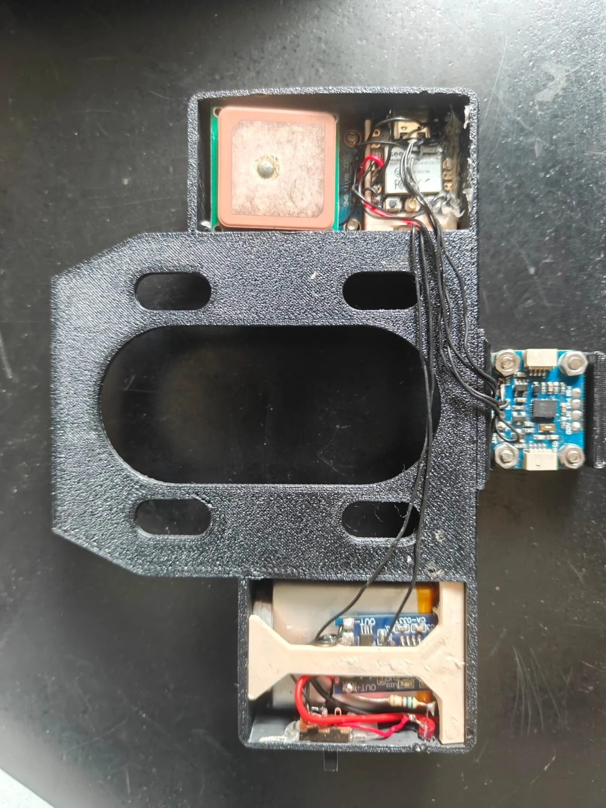
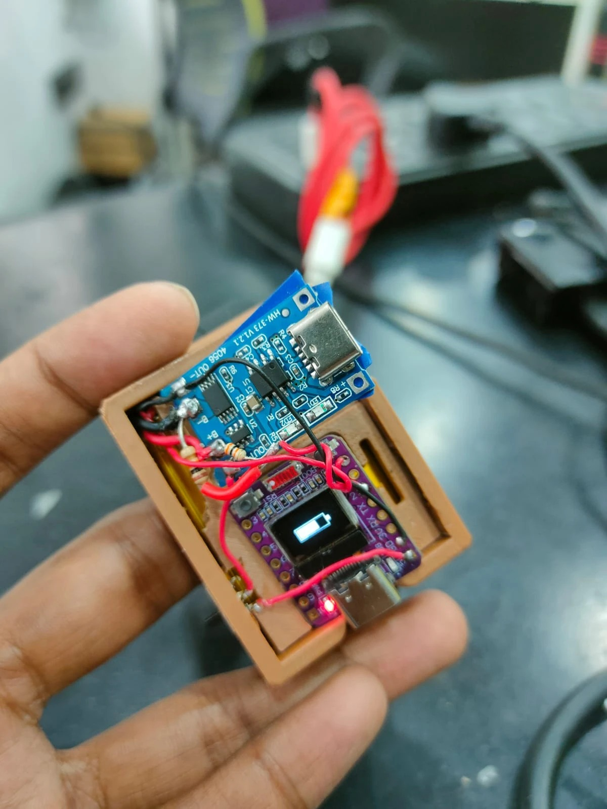
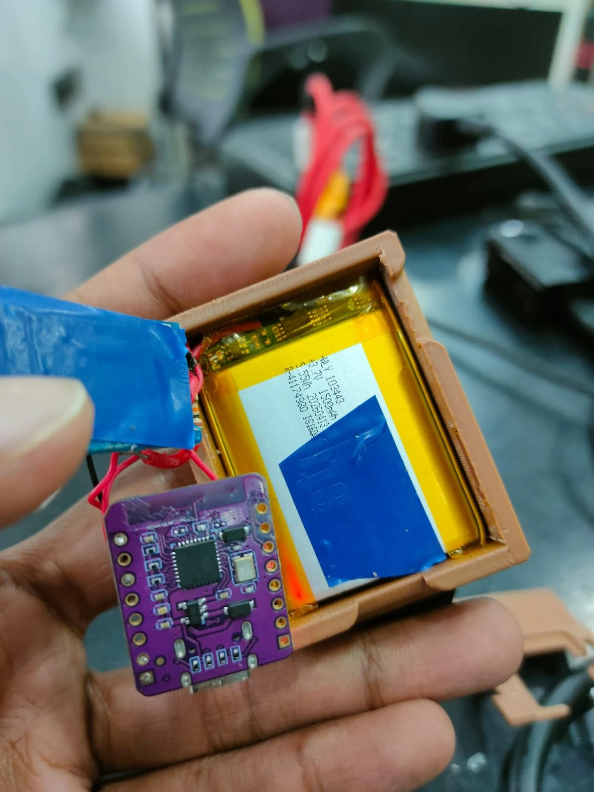
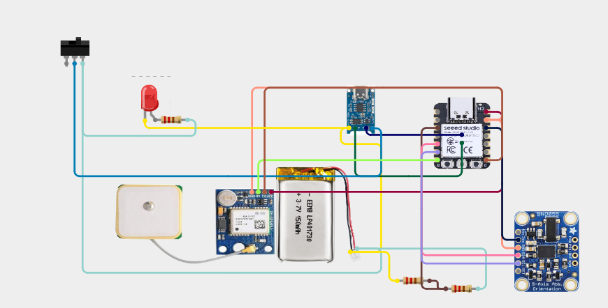
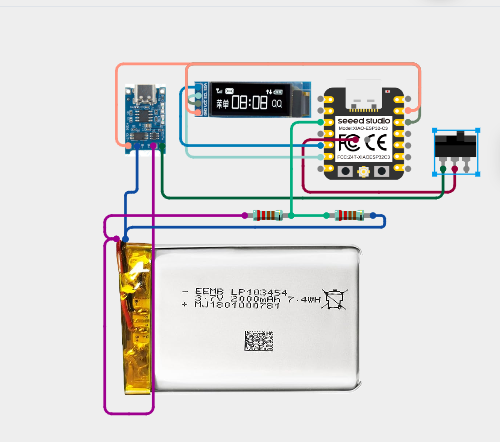

# Phase 2 — Hardware and Enclosure (Week 2)

**Planned:** mechanical layout for the IMU and GPS, 3D-printed board housing and wrist casing, ESP32 toolchain, basic IMU and GPS communication.

**Delivered:** both enclosures printed and populated, the toolchain running on Arduino IDE with ESP32 core 3.2.0 on XIAO_ESP32C3, and both sensors talking to the board.

## Hardware as built

| Unit | Component | Connection |
|---|---|---|
| Board | Seeed XIAO ESP32-C3 | Mounted under the deck |
| Board | BNO055 IMU | I2C — SDA GPIO6 (D4), SCL GPIO7 (D5), address 0x28, fused mode |
| Board | NEO-8M GPS | UART1 — RX GPIO20, TX GPIO21, 9600 baud |
| Board | Battery sense | ADC GPIO4 (ADC1_CH4), divider 30k / 10k |
| Board | 1500 mAh lithium cell, USB-C charging module, slide switch | Cell to charger, charger output through the switch to the XIAO |
| Wrist | Seeed XIAO ESP32-C3 | Worn on the strap |
| Wrist | SSD1306 128×32 OLED | I2C — SDA GPIO6 (D4), SCL GPIO7 (D5), driven by U8g2 |
| Wrist | Vibration motor | GPIO3 |
| Wrist | Status LED | GPIO8 |
| Wrist | Battery sense | ADC GPIO2 (D0), divider R1 = 30k / R2 = 10k, 11 dB attenuation |
| Wrist | 1500 mAh lithium cell, HW-373 V1.2 USB-C charging module, slide switch | Same arrangement as the board unit |
| Link | ESP-NOW broadcast | Channel follows the phone hotspot |

The BNO055 runs its own sensor fusion, so the ESP32 reads finished Euler angles and a gyroscope vector instead of filtering raw accelerometer data inside the control loop. Battery voltage is averaged over several ADC reads, because a single read on this chip swings the reported percentage by several points.

The board sketch uses 91% of the default 1.25 MB program partition and 12% of RAM. Session data lives in a separate LittleFS partition, so a nearly full sketch cannot push the stored rides out.

## Printed, populated and mounted

The CAD from [Phase 1](../Phase%201%20-%20Foundation%20%26%20Design) came out as two printed enclosures. The plate bolts around the truck baseplate with the IMU pod hanging off the deck's edge; the charging module, cell and power switch sit in the upper compartment, the XIAO and the GPS antenna in the lower one.

The wrist unit stacks an HW-373 V1.2 USB-C charging module (TP4056 class) over the XIAO, with the OLED facing out through the lid.

## Wiring

Each unit is wired the same way: the cell feeds a USB-C charging module, the module's output passes through a slide switch to the XIAO, and the sensors or display hang off the XIAO's I2C and UART pins. The resistors are the I2C pull-ups and the indicator-LED series resistor. Both units run a 3.7 V 1500 mAh cell; the capacities printed on the diagram artwork are stand-ins from the drawing tool.

| Signal | Board unit | Wrist unit |
|---|---|---|
| I2C data | GPIO6 (D4) to BNO055 | GPIO6 (D4) to OLED |
| I2C clock | GPIO7 (D5) to BNO055 | GPIO7 (D5) to OLED |
| Serial | GPIO20 RX, GPIO21 TX to NEO-8M at 9600 baud | — |
| Battery sense | GPIO4 (ADC1_CH4) through a 30k/10k divider | GPIO2 (D0) through a 30k/10k divider |
| Motor | — | GPIO3 |
| Status LED | Indicator LED on the charging module | GPIO8 |

The firmware checks these rather than assuming them: `imuInit()` scans the I2C bus at boot and prints every address that answers, and `batteryInit()` logs one raw ADC count, so a wrong pad shows up immediately instead of as a reading that never moves.
