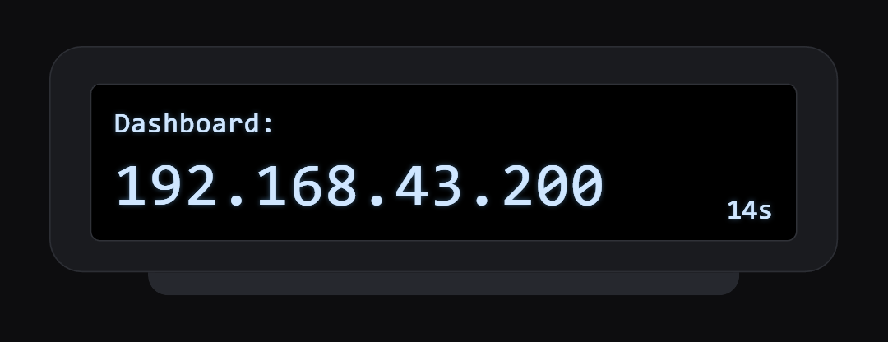

# Phase 4 — Wireless Alerts and Bail Detection (Week 4)

**Planned:** a wireless link between board and wearable, haptic feedback on confirmed wobbles, and bail detection separating landings from bails.

**Delivered:** an ESP-NOW link with channel hunting, the wrist motor and LED pulsing on each wobble the board confirms, and bails separated from lands by how far the deck swings after the rotation.

| Document | What it covers |
|---|---|
| [wearable-receiver.md](wearable-receiver.md) | Pins, OLED layout, channel hunting, link loss and the display states |

## The link

The board broadcasts telemetry over ESP-NOW, which runs alongside its hotspot connection and needs no pairing. Its peer is registered on channel 0, so it follows whatever channel the phone picks. The wrist unit does not know that channel at power-up, so it parks on each channel for 300 ms until packets arrive, then reads the channel the board states inside the packet and retunes to it.

The packet carries speed, distance, the board's battery, its dashboard address, GPS fix state and a `wobbleActive` flag.

## Haptic alert path

| Step | Where |
|---|---|
| Three oscillations counted, wobble confirmed | Board firmware, motion state machine |
| `wobbleActive` set true for one packet | Board, ESP-NOW telemetry |
| Flag latched for 500 ms on screen, counted as ongoing for 1500 ms | Wrist firmware |
| Motor on GPIO3 and LED on GPIO8 pulsed, non-blocking | Wrist firmware |
| Wobble counted into the recording session | Board, `sessionNoteWobble()` |

Serial printing was moved out of the ESP-NOW receive callback into a drained queue. Printing inside the callback blocks the WiFi task long enough to drop the following packets, which made a healthy radio link look unreliable.

## Bail detection

The plan called for an accelerometer impact spike after a trick. That was replaced: a clean landing can produce a sharp impact and a bail can produce none, so the spike does not separate them. What does is the settling swing — a flip that settles within 83 degrees inside 1000 ms is a land, anything wider or slower is a bail.

## Still open

The motor has been fired from bench shakes, not from a real speed wobble at riding speed. That test belongs to Phase 6.
