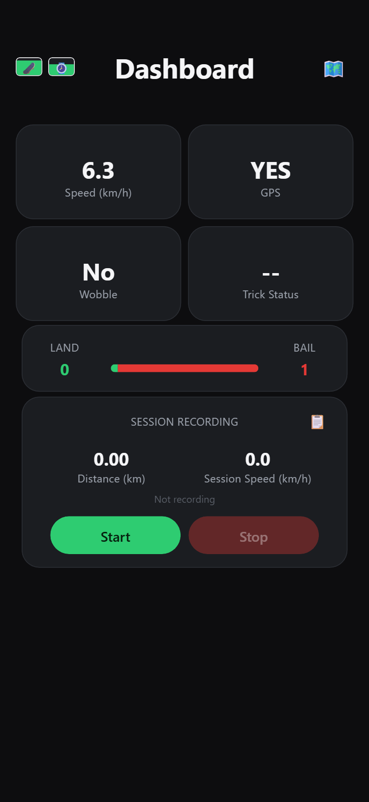
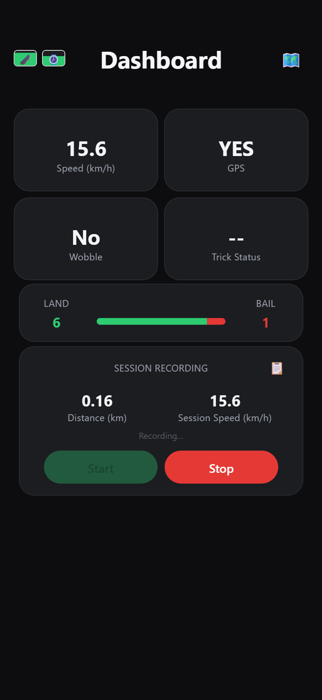
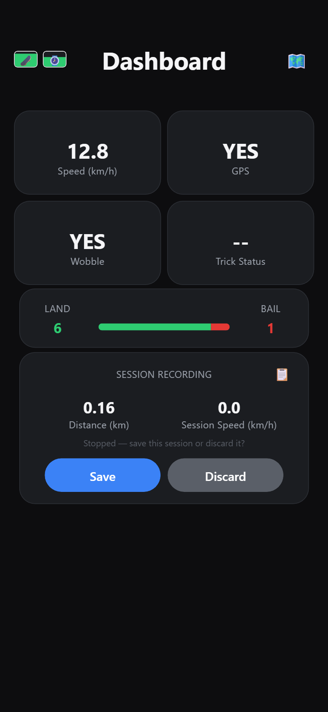
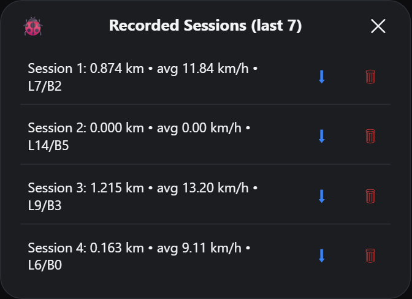

# Phase 5 — Companion Dashboard and Data Logging (Week 5)

**Planned:** a companion app or dashboard, GPS route mapping, ride statistics, a post-ride summary and live sync.

**Delivered:** a dashboard served by the board itself over the phone hotspot, with a live map, session recording, a post-ride summary covering distance, top speed, wobble alerts and trick counts, and per-session downloads.

| Document | What it covers |
|---|---|
| [local-dashboard.md](local-dashboard.md) | Hotspot join, the stable address, the embedded page and the endpoints |
| [sessions-and-downloads.md](sessions-and-downloads.md) | On-board storage, the route file format, map rendering and downloads |

## No app to install

The board joins the rider's phone hotspot, takes a DHCP lease, then moves itself to `<subnet>.200` and verifies the move, so the dashboard address is predictable on any phone. It also answers to `skateguard.local`, though phone support for that is inconsistent, which is why the wrist unit displays the numeric address. The page is stored in flash inside the sketch and served whole; the browser polls `/api/live` twice a second.

| Endpoint | Purpose |
|---|---|
| `/` | The dashboard page |
| `/api/live` | Telemetry JSON, polled twice a second |
| `/api/debug` | Motion state machine, GPS, radio and memory values |
| `/api/sessions` | Saved sessions and their routes |
| `/api/command?cmd=` | `start`, `stop`, `save`, `discard`, `delete:<n>` |
| `/log`, `/clear` | Download or clear the motion log |
| `/manifest.json` | Web app manifest for "Add to Home screen" |





## Post-ride summary

Stopping a ride does not save it: the card offers Save or Discard, and nothing is written until one is chosen. A saved ride stores distance, average speed, top speed, land count, bail count and wobble-alert count, with its route as a separate line.

```
timestamp_ms,avg_speed_kmh,distance_km,land_count,bail_count,top_speed_kmh,wobble_count
842113,11.84,0.874,7,2,19.60,1
```

`top_speed_kmh` and `wobble_count` are appended after the original columns, so a `sessions.csv` written by earlier firmware still parses — the dashboard reads by position and treats the two new fields as unknown when they are missing.





The last 7 rides are kept, with a route point every 30 seconds up to 20 points. Each row downloads as a CSV of the ride plus a rendered PNG of its route, drawn in the browser over OpenStreetMap tiles. Route line N belongs to session N, with a `-` placeholder for rides recorded without GPS.
