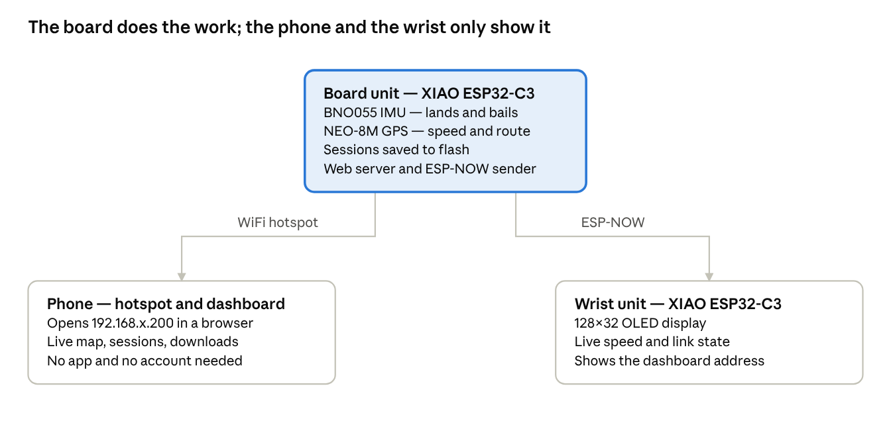
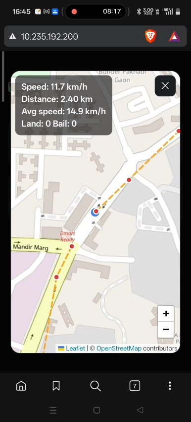

# SkateGuard — Documentation

Build documentation for SkateGuard, one folder per project phase, matching the six weeks of the plan, plus the finished user manual and the project report.

| Phase | Week | What is in it |
|---|---|---|
| [Phase 1 - Foundation & Design](Phase%201%20-%20Foundation%20%26%20Design) | Week 1 | Layout, parts list, detection approach and the CAD design of both enclosures |
| [Phase 2 - Hardware & Enclosure](Phase%202%20-%20Hardware%20%26%20Enclosure) | Week 2 | Hardware as built, the printed and populated units, wiring diagrams and the pin table |
| [Phase 3 - Sensor & Embedded System](Phase%203%20-%20Sensor%20%26%20Embedded%20System) | Week 3 | Trick detection state machine, thresholds, GPS speed, route and diagnostics |
| [Phase 4 - Wireless Alerts & Bail Detection](Phase%204%20-%20Wireless%20Alerts%20%26%20Bail%20Detection) | Week 4 | ESP-NOW link, channel hunting, the haptic alert path and bail classification |
| [Phase 5 - Companion Dashboard & Data Logging](Phase%205%20-%20Companion%20Dashboard%20%26%20Data%20Logging) | Week 5 | Self-hosted dashboard, session storage, post-ride summary and downloads |
| [Phase 6 - Testing, Tuning & Demonstration](Phase%206%20-%20Testing%2C%20Tuning%20%26%20Demonstration) | Week 6 | What has been tested, what it showed, and what is still open |
| [Final Report](Final%20Report) | — | The user manual and the six-week project report, as PDF, Word and a web page |

Each phase folder opens with what that week planned and what it delivered, then the detail: the parts and pins it uses, the constants that tune it, how it was tested and what is still open.

## The system in one paragraph

A Seeed XIAO ESP32-C3 under the deck reads a BNO055 IMU and a NEO-8M GPS. It counts kickflip lands and bails, measures speed and distance, and serves a dashboard from its own flash over the rider's phone hotspot. A second XIAO ESP32-C3 worn on the wrist receives speed and battery over ESP-NOW, buzzes on a confirmed speed wobble, and shows the dashboard address so the rider never has to look it up. Sessions are stored on the board itself and can be downloaded from the phone.

